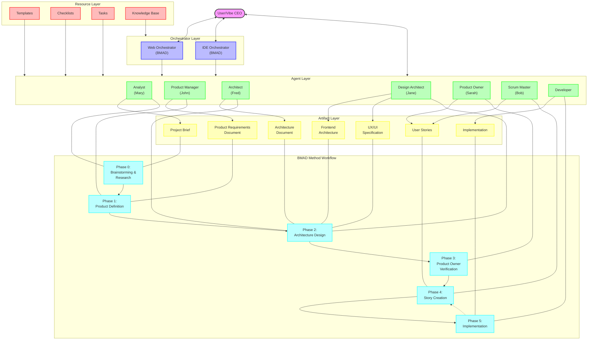

# BMAD Method Architecture Document

## Introduction

The BMAD Method (Breakthrough Method of Agile AI-driven Development) represents a revolutionary approach to software development that leverages AI agents to streamline the entire development lifecycle. This document provides a comprehensive architectural overview of the BMAD Method, designed to be accessible to non-technical stakeholders while accurately representing the system's structure, components, and workflows.

At its core, the BMAD Method embodies the concept of "Vibe CEO'ing" - thinking like a CEO with unlimited resources and a singular vision, while leveraging AI as a high-powered team to achieve ambitious goals rapidly. The architecture facilitates this by organizing specialized AI agents, resources, and workflows into a cohesive system that guides projects from ideation to implementation.

## Architectural Overview

The BMAD Method architecture consists of several interconnected layers that work together to support the development process. The diagram below illustrates these layers and their relationships:

## Key Architectural Components

### User/Vibe CEO

At the top of the architecture sits the User, also referred to as the "Vibe CEO." This represents the human stakeholder who directs the entire process, provides vision, and makes critical decisions. The Vibe CEO interacts with the system through either the Web Orchestrator, IDE Orchestrator, or directly with individual agents. This role embodies the BMAD Method's core philosophy of thinking like a CEO with unlimited resources and a singular vision, leveraging AI agents as a high-powered team to achieve ambitious goals rapidly.

### Orchestrator Layer

The Orchestrator Layer serves as the primary interface between the User and the specialized AI agents. This layer consists of two main components:

1. **Web Orchestrator (BMAD)**: This orchestrator operates in web-based environments like Gemini 2.5 or OpenAI's custom GPTs. It's built using a Node.js script that bundles all necessary assets (personas, tasks, templates, checklists, and knowledge base) into a cohesive package. The Web Orchestrator can embody any of the specialized agent personas based on user requests, effectively becoming that agent for the duration of the interaction. This versatility makes it particularly valuable in web environments where creating multiple custom agents might be impractical.

2. **IDE Orchestrator (BMAD)**: Similar to the Web Orchestrator but designed for integrated development environments (IDEs) like Cursor or Windsurf. The IDE Orchestrator dynamically loads configuration and persona files without requiring a build step. It can also transform into any specialized agent based on user needs, making it a flexible solution for development environments.

Both orchestrators access the Knowledge Base to understand the BMAD Method's principles, agent roles, and workflows. They serve as the central coordination point, allowing users to seamlessly switch between different agent personas without needing to configure multiple separate agents.

### Agent Layer

The Agent Layer consists of specialized AI personas, each with distinct roles, responsibilities, and expertise. These agents work sequentially through the development lifecycle, though they can be engaged in different orders based on project needs. The primary agents include:

1. **Analyst (Mary)**: Focuses on the initial phases of a project, including brainstorming, deep research, and creating project briefs. Mary helps clarify project vision, gather requirements, and establish the foundation for further development.

2. **Product Manager (John)**: Takes the project brief and transforms it into a comprehensive Product Requirements Document (PRD). John defines product features, prioritizes requirements, and ensures the product vision aligns with business goals.

3. **Architect (Fred)**: Designs the technical architecture based on the PRD. Fred makes critical technology decisions, defines system components and their interactions, and creates architecture documentation that guides implementation.

4. **Design Architect (Jane)**: Specializes in frontend architecture and user experience. Jane creates UI/UX specifications and frontend architectural designs that complement the system architecture.

5. **Product Owner (Sarah)**: Verifies that the architecture and requirements align with product vision. Sarah runs checklists to ensure quality and approves the project to move forward to implementation.

6. **Scrum Master (Bob)**: Creates and manages user stories derived from the PRD and architecture documents. Bob ensures stories are well-defined, prioritized, and ready for implementation.

7. **Developer**: Implements the user stories, tests the implementation, and deploys the solution. The Developer agent works iteratively, completing stories and seeking approval before moving to the next.

Each agent can access relevant templates, checklists, and tasks to perform their specific functions. The agents can be engaged directly by the user or through an orchestrator that embodies their persona.

### Resource Layer

The Resource Layer provides the tools, templates, and knowledge that agents need to perform their functions effectively. This layer includes:

1. **Templates**: Standardized formats for various documents like project briefs, PRDs, architecture documents, and user stories. Templates ensure consistency and completeness across project artifacts.

2. **Checklists**: Quality assurance tools that help verify that artifacts meet required standards. Different agents use specific checklists relevant to their role, such as the Architect Checklist or the Story Definition of Done Checklist.

3. **Tasks**: Self-contained instruction sets that define specific jobs an agent can perform. Tasks reduce agent complexity by keeping rarely used instructions separate from the core agent definition. They can be invoked on demand when needed.

4. **Knowledge Base**: A central repository of information about the BMAD Method, including principles, best practices, agent roles, and workflows. The Knowledge Base primarily informs the orchestrators but indirectly influences all agents.

These resources are stored in specific directories within the BMAD project structure and are referenced by agents and orchestrators as needed.

### Artifact Layer

The Artifact Layer represents the tangible outputs produced throughout the development lifecycle. These artifacts flow from one phase to the next, with each building upon previous work:

1. **Project Brief**: Created by the Analyst, this document outlines the project vision, goals, target audience, and high-level requirements. It serves as the foundation for the PRD.

2. **Product Requirements Document (PRD)**: Developed by the Product Manager, the PRD details product features, user stories, acceptance criteria, and priorities. It guides architectural decisions and implementation.

3. **Architecture Document**: Produced by the Architect, this document defines the system's technical architecture, including components, interfaces, data models, and technology choices.

4. **Frontend Architecture**: Created by the Design Architect, this document specifies the structure and organization of the frontend codebase, including frameworks, libraries, and patterns.

5. **UX/UI Specification**: Also developed by the Design Architect, this document details the user interface design, user experience flow, and interaction patterns.

6. **User Stories**: Generated by the Scrum Master and Product Owner, these are discrete units of work derived from the PRD and architecture documents. Stories guide implementation and testing.

7. **Implementation**: The actual code, tests, and deployable assets created by the Developer agent based on user stories.

These artifacts represent the progression of the project from concept to reality, with each building upon and refining the previous.

### Workflow Layer

The Workflow Layer illustrates the sequential phases of the BMAD Method development process:

1. **Phase 0: Brainstorming & Research**: The initial phase where project ideas are explored, research is conducted, and a project brief is created. This phase is primarily driven by the Analyst.

2. **Phase 1: Product Definition**: Using the project brief as input, the Product Manager creates a comprehensive PRD that defines what will be built.

3. **Phase 2: Architecture Design**: Based on the PRD, the Architect and Design Architect create technical and frontend architecture documents, as well as UI/UX specifications.

4. **Phase 3: Product Owner Verification**: The Product Owner reviews all artifacts using checklists to ensure quality and alignment with the project vision.

5. **Phase 4: Story Creation**: The Scrum Master breaks down the PRD and architecture documents into implementable user stories.

6. **Phase 5: Implementation**: The Developer implements user stories, tests the implementation, and deploys the solution.

The workflow is generally sequential, but there's a feedback loop from Implementation back to Story Creation, reflecting the iterative nature of agile development. As stories are completed, new ones are created until the project is finished.

## Integration and Interaction Patterns

The BMAD Method architecture features several key integration and interaction patterns that enable its functionality:

### User-Orchestrator Interaction

The User (Vibe CEO) primarily interacts with the system through the orchestrators, which serve as the main interface. The user can request specific agents, tasks, or information, and the orchestrator responds accordingly. This interaction can occur in web environments (through the Web Orchestrator) or in development environments (through the IDE Orchestrator).

The orchestrators provide commands like `/help`, `/agent-list`, `/tasks`, and `/agent-{name}` that facilitate navigation and agent selection. They can also toggle between interactive and "YOLO" (You Only Live Once) modes, with the latter allowing for faster, less interactive processing.

### Orchestrator-Agent Transformation

A distinctive feature of the BMAD architecture is the ability of orchestrators to transform into specialized agents. When a user requests a specific agent, the orchestrator:

1. Loads the agent's persona definition from the appropriate file
2. Applies any customizations specified in the configuration
3. Adopts the agent's personality, responsibilities, and knowledge
4. Responds as that agent until instructed to switch

This transformation allows for a seamless experience where users can interact with different specialized agents without needing to switch between multiple systems or interfaces.

### Agent-Resource Utilization

Agents utilize resources from the Resource Layer to perform their functions. For example:

- The Product Manager uses the PRD template to structure the requirements document
- The Architect references the architecture template when designing the system
- The Product Owner runs checklists to verify artifact quality
- Agents can invoke specific tasks when needed for specialized functions

This resource utilization ensures consistency, quality, and efficiency across the development process.

### Artifact Flow

Artifacts flow through the system in a generally sequential manner, with each phase building upon the outputs of previous phases:

1. The Project Brief informs the PRD
2. The PRD guides Architecture and UI/UX design
3. Architecture documents and the PRD are used to create User Stories
4. User Stories direct Implementation

This flow ensures that each step in the development process has the necessary inputs from previous steps, maintaining coherence and alignment throughout.

### Workflow Progression

The workflow progresses through distinct phases, each associated with specific agents and artifacts. While the standard flow is sequential, the architecture allows for flexibility:

- Phases can be revisited if needed (iterative refinement)
- The order of agents can be customized based on project needs
- Multiple agents can be engaged simultaneously for collaborative work

This flexibility allows the BMAD Method to adapt to different project types, team structures, and development approaches.

## Physical Architecture and Implementation

The BMAD Method is implemented as a collection of files organized in a specific directory structure:

- **bmad-agent/**: The main directory containing all agent definitions and resources
  - **personas/**: Contains agent persona definitions (e.g., analyst.md, pm.md)
  - **tasks/**: Contains task instruction sets (e.g., create-prd.md, checklist-run-task.md)
  - **templates/**: Contains document templates (e.g., prd-tmpl.md, architecture-tmpl.md)
  - **checklists/**: Contains quality verification checklists (e.g., architect-checklist.md)
  - **data/**: Contains knowledge base and other persistent data

- **docs/**: Contains documentation about the BMAD Method itself

- **build scripts**: Node.js scripts that bundle assets for the Web Orchestrator

The implementation supports two primary deployment models:

1. **Web Agent**: Created by running a build script that generates a bundled package for platforms like Gemini 2.5 or OpenAI's custom GPTs. This includes an agent prompt file and bundled asset files.

2. **IDE Agents**: Either standalone agent files that can be directly loaded into IDEs like Cursor or Windsurf, or an IDE Orchestrator that dynamically loads agent definitions.

## Conclusion

The BMAD Method architecture represents a sophisticated yet flexible approach to AI-driven agile development. By organizing specialized agents, resources, artifacts, and workflows into a cohesive system, it enables users to leverage AI capabilities throughout the development lifecycle.

The architecture's key strengths include:

1. **Flexibility**: The ability to engage agents in different orders and combinations based on project needs
2. **Specialization**: Dedicated agents with specific expertise for each phase of development
3. **Integration**: Seamless flow of information and artifacts between phases
4. **Orchestration**: Central coordination through orchestrator agents that can embody any specialized role
5. **Resource Utilization**: Standardized templates, checklists, and tasks that ensure consistency and quality

For users new to the BMAD Method, the architecture provides clear entry points through the orchestrators, which can guide users to the appropriate agents based on their current needs. For experienced users, the architecture offers the flexibility to customize workflows, agent behaviors, and resource utilization to fit specific project requirements.

By embracing the "Vibe CEO" philosophy and leveraging AI agents as a high-powered team, the BMAD Method architecture enables ambitious software development goals to be achieved with unprecedented speed and quality.
