# BMAD Method: Comprehensive Architectural Overview

## Table of Contents

1. [Introduction](#introduction)
2. [Core Philosophy and Principles](#core-philosophy-and-principles)
3. [Architectural Overview](#architectural-overview)
4. [Architectural Diagram](#architectural-diagram)
5. [Detailed Architecture Components](#detailed-architecture-components)
   - [Deployment Environments](#deployment-environments)
   - [Orchestrator Layer](#orchestrator-layer)
   - [Agent Layer](#agent-layer)
   - [Resource Layer](#resource-layer)
   - [Artifact Layer](#artifact-layer)
   - [Workflow Layer](#workflow-layer)
   - [Build System](#build-system)
6. [Integration and Interaction Patterns](#integration-and-interaction-patterns)
7. [Physical Architecture and Implementation](#physical-architecture-and-implementation)
8. [Usage Recommendations](#usage-recommendations)
9. [Conclusion](#conclusion)
10. [References](#references)

## Introduction

The BMAD Method (Breakthrough Method of Agile AI-driven Development) represents a revolutionary approach to software development that leverages AI agents to streamline the entire development lifecycle. This document provides a comprehensive architectural overview of the BMAD Method, designed to be accessible to non-technical stakeholders while accurately representing the system's structure, components, and workflows.

At its core, the BMAD Method embodies the concept of "Vibe CEO'ing" - thinking like a CEO with unlimited resources and a singular vision, while leveraging AI as a high-powered team to achieve ambitious goals rapidly. The architecture facilitates this by organizing specialized AI agents, resources, and workflows into a cohesive system that guides projects from ideation to implementation.

## Core Philosophy and Principles

The BMAD Method is built on a foundation of key principles that guide its implementation and use:

### Vibe CEO'ing

The central philosophy of the BMAD Method is "Vibe CEO'ing," which encourages users to:
- Think like a CEO with unlimited resources and a singular vision
- Leverage AI agents as a high-powered team to achieve ambitious goals rapidly
- Embrace chaos while maintaining strategic oversight
- Focus on quality control as the ultimate arbiter of project success

### Core Principles

1. **Maximize AI Leverage**: Push the AI capabilities to their limits, challenge outputs, and iterate for continuous improvement.
2. **Quality Control**: The user (Vibe CEO) serves as the ultimate arbiter of quality, reviewing all outputs.
3. **Strategic Oversight**: Maintain a high-level vision and ensure all agent outputs align with this vision.
4. **Iterative Refinement**: Expect to revisit steps as the process is non-linear and requires continuous improvement.
5. **Clear Instructions**: Provide precise requests to obtain optimal AI outputs.
6. **Documentation is Key**: Good inputs (briefs, PRDs) lead to good outputs.
7. **Know Your Agents**: Understand each agent's role and capabilities.
8. **Start Small, Scale Fast**: Test concepts before expanding.
9. **Embrace the Chaos**: Adapt and overcome challenges in pioneering new methods.
10. **Adapt & Experiment**: Customize the method to fit specific project needs and working styles.

## Architectural Overview

The BMAD Method architecture consists of several interconnected layers that work together to support the development process:

1. **Deployment Environments**: The contexts in which the BMAD Method operates
2. **Orchestrator Layer**: The primary interface between users and specialized agents
3. **Agent Layer**: Specialized AI personas with distinct roles and responsibilities
4. **Resource Layer**: Tools, templates, and knowledge that agents use
5. **Artifact Layer**: Tangible outputs produced throughout the development lifecycle
6. **Workflow Layer**: Sequential phases of the development process
7. **Build System**: Tools for packaging and deploying the BMAD agents

Each layer plays a crucial role in the overall architecture, with clear relationships and interactions between components.

## Architectural Diagram

The following diagram illustrates the BMAD Method architecture, showing the relationships between its various components:

```mermaid
flowchart TB
    %% Main Components
    User(["User/Vibe CEO"])
    
    %% Deployment Environments
    subgraph Environments["Deployment Environments"]
        WebEnv["Web Environment\n(Gemini/ChatGPT)"]
        IDEEnv["IDE Environment\n(Cursor/Windsurf)"]
    end
    
    %% Orchestrator Layer
    subgraph Orchestrators["Orchestrator Layer"]
        WebOrch["Web Orchestrator\n(BMAD)"]
        IDEOrch["IDE Orchestrator\n(BMAD)"]
    end
    
    %% Agent Layer
    subgraph Agents["Agent Layer"]
        subgraph PlanningAgents["Planning & Design Agents"]
            Analyst["Analyst\n(Mary/Larry)"]
            PM["Product Manager\n(John/Jack)"]
            Architect["Architect\n(Fred/Mo)"]
            DesignArch["Design Architect\n(Jane/Millie)"]
        end
        
        subgraph DeliveryAgents["Delivery & Implementation Agents"]
            PO["Product Owner\n(Sarah/Curly)"]
            SM["Scrum Master\n(Bob/SallySM)"]
            Dev["Developer\n(Dana/DevFE/Dev)"]
            DevOps["DevOps/Platform Engineer\n(Alex)"]
        end
    end
    
    %% Resource Layer
    subgraph Resources["Resource Layer"]
        subgraph StructuredResources["Structured Resources"]
            Templates["Templates"]
            Checklists["Checklists"]
        end
        
        subgraph DynamicResources["Dynamic Resources"]
            Tasks["Tasks"]
            KnowledgeBase["Knowledge Base"]
        end
    end
    
    %% Artifact Layer
    subgraph Artifacts["Artifact Layer"]
        subgraph PlanningArtifacts["Planning Artifacts"]
            ProjectBrief["Project Brief"]
            PRD["Product Requirements\nDocument"]
        end
        
        subgraph DesignArtifacts["Design Artifacts"]
            ArchDoc["Architecture\nDocument"]
            FrontendArch["Frontend\nArchitecture"]
            UXUISpec["UX/UI\nSpecification"]
            InfraArch["Infrastructure\nArchitecture"]
        end
        
        subgraph ImplementationArtifacts["Implementation Artifacts"]
            Stories["User Stories"]
            Implementation["Implementation"]
            Deployment["Deployment"]
        end
    end
    
    %% Workflow Phases
    subgraph Workflow["BMAD Method Workflow"]
        Phase0["Phase 0:\nBrainstorming &\nResearch"]
        Phase1["Phase 1:\nProduct Definition"]
        Phase2["Phase 2:\nArchitecture Design"]
        Phase3["Phase 3:\nProduct Owner\nVerification"]
        Phase4["Phase 4:\nStory Creation"]
        Phase5["Phase 5:\nImplementation"]
    end
    
    %% Build System
    subgraph BuildSystem["Build System"]
        BuildScript["build-web-agent.js"]
        ConfigFile["build-web-agent.cfg.js"]
        WebConfig["web-bmad-orchestrator-agent.cfg.md"]
        IDEConfig["ide-bmad-orchestrator.cfg.md"]
    end
    
    %% User Interactions
    User <--> WebEnv
    User <--> IDEEnv
    User <--> Agents
    
    %% Environment Connections
    WebEnv --> WebOrch
    IDEEnv --> IDEOrch
    
    %% Orchestrator Connections
    WebOrch --> Agents
    IDEOrch --> Agents
    
    %% Build System Connections
    BuildScript --> WebOrch
    ConfigFile --> BuildScript
    WebConfig --> WebOrch
    IDEConfig --> IDEOrch
    
    %% Resource Connections
    Templates --> Agents
    Checklists --> Agents
    Tasks --> Agents
    KnowledgeBase --> Orchestrators
    
    %% Agent to Artifact Connections
    Analyst --> ProjectBrief
    PM --> PRD
    Architect --> ArchDoc
    DesignArch --> FrontendArch
    DesignArch --> UXUISpec
    DevOps --> InfraArch
    PO --> Stories
    SM --> Stories
    Dev --> Implementation
    DevOps --> Deployment
    
    %% Workflow Connections
    Phase0 --> Phase1
    Phase1 --> Phase2
    Phase2 --> Phase3
    Phase3 --> Phase4
    Phase4 --> Phase5
    Phase5 -.-> Phase4
    
    %% Agent to Workflow Connections
    Analyst --- Phase0
    PM --- Phase1
    Architect --- Phase2
    DesignArch --- Phase2
    DevOps --- Phase2
    PO --- Phase3
    SM --- Phase4
    Dev --- Phase5
    DevOps --- Phase5
    
    %% Artifact to Workflow Connections
    ProjectBrief --- Phase0
    PRD --- Phase1
    ArchDoc --- Phase2
    FrontendArch --- Phase2
    UXUISpec --- Phase2
    InfraArch --- Phase2
    Stories --- Phase4
    Implementation --- Phase5
    Deployment --- Phase5
    
    %% Styling
    classDef user fill:#f9f,stroke:#333,stroke-width:2px
    classDef environment fill:#e6f7ff,stroke:#1890ff,stroke-width:2px
    classDef orchestrator fill:#bbf,stroke:#33f,stroke-width:2px
    classDef agent fill:#bfb,stroke:#3f3,stroke-width:2px
    classDef resource fill:#fbb,stroke:#f33,stroke-width:2px
    classDef artifact fill:#ffb,stroke:#ff3,stroke-width:2px
    classDef workflow fill:#bff,stroke:#3ff,stroke-width:2px
    classDef build fill:#ffd,stroke:#dd3,stroke-width:2px
    
    class User user
    class WebEnv,IDEEnv environment
    class WebOrch,IDEOrch orchestrator
    class Analyst,PM,Architect,DesignArch,PO,SM,Dev,DevOps agent
    class Templates,Checklists,Tasks,KnowledgeBase resource
    class ProjectBrief,PRD,ArchDoc,FrontendArch,UXUISpec,InfraArch,Stories,Implementation,Deployment artifact
    class Phase0,Phase1,Phase2,Phase3,Phase4,Phase5 workflow
    class BuildScript,ConfigFile,WebConfig,IDEConfig build
```



The diagram illustrates the layered architecture of the BMAD Method, showing how the User (Vibe CEO) interacts with the system through different environments, how orchestrators coordinate specialized agents, how agents utilize resources to produce artifacts, and how the workflow progresses through distinct phases.


## Detailed Architecture Components

### Deployment Environments

The BMAD Method is designed to operate in two primary environments:

#### Web Environment (Gemini/ChatGPT)

The web environment leverages large language model platforms like Gemini 2.5 or OpenAI's ChatGPT with custom GPTs. This environment offers:

- **Large Context Windows**: Ability to process and maintain extensive context, making it ideal for complex planning and ideation phases.
- **Simplified Setup**: The Web Orchestrator is created through a build process that bundles all necessary assets into a format suitable for web-based AI platforms.
- **Accessibility**: Users can access the BMAD Method without specialized software, using only a web browser.
- **Ideal Use Cases**: Conceptual and planning phases, including brainstorming, research, product definition, and architecture design.

#### IDE Environment (Cursor/Windsurf)

The IDE (Integrated Development Environment) implementation operates within code editors like Cursor or Windsurf. This environment provides:

- **Direct Code Integration**: Agents can directly interact with code files, making implementation more efficient.
- **Specialized Agents**: Optimized for smaller context windows, with dedicated agents like `dev.ide.md` and `sm.ide.md` for specific roles.
- **Dynamic Loading**: The IDE Orchestrator can load configuration and persona files without requiring a build step.
- **Ideal Use Cases**: Technical design, documentation management, and implementation phases, particularly story creation and code development.

### Orchestrator Layer

The Orchestrator Layer serves as the primary interface between the User (Vibe CEO) and the specialized AI agents. This layer consists of two main components:

#### Web Orchestrator (BMAD)

The Web Orchestrator operates in web-based environments like Gemini 2.5 or OpenAI's custom GPTs. Key characteristics include:

- **Build Process**: Created using a Node.js script (`build-web-agent.js`) that bundles all necessary assets (personas, tasks, templates, checklists, and knowledge base) into a cohesive package.
- **Configuration**: Configured through `build-web-agent.cfg.js` and `web-bmad-orchestrator-agent.cfg.md`.
- **Persona Transformation**: Can embody any of the specialized agent personas based on user requests, effectively becoming that agent for the duration of the interaction.
- **Asset Management**: Accesses bundled assets like `personas.txt`, `tasks.txt`, etc., to retrieve specific sections as needed.
- **Versatility**: Particularly valuable in web environments where creating multiple custom agents might be impractical.

#### IDE Orchestrator (BMAD)

Similar to the Web Orchestrator but designed for integrated development environments (IDEs) like Cursor or Windsurf. Key features include:

- **Dynamic Loading**: Loads configuration and persona files without requiring a build step.
- **Configuration**: Configured through `ide-bmad-orchestrator.cfg.md`, which defines data resolution paths and agent definitions.
- **Persona Transformation**: Can transform into any specialized agent based on user needs.
- **File System Integration**: Directly accesses files in the project structure based on configured paths.
- **Flexibility**: Provides a versatile solution for development environments with limitations on the number of custom agents.

Both orchestrators access the Knowledge Base to understand the BMAD Method's principles, agent roles, and workflows. They serve as the central coordination point, allowing users to seamlessly switch between different agent personas without needing to configure multiple separate agents.

### Agent Layer

The Agent Layer consists of specialized AI personas, each with distinct roles, responsibilities, and expertise. These agents work sequentially through the development lifecycle, though they can be engaged in different orders based on project needs.

#### Planning & Design Agents

##### Analyst (Mary/Larry)

- **Function**: Handles the initial phases of a project, including brainstorming, deep research, and creating project briefs.
- **Web Persona**: `Analyst (Mary)` with persona `personas#analyst`. Customized to be "a bit of a know-it-all, and likes to verbalize and emote."
- **IDE Persona**: `Analyst (Larry)` with persona `analyst.md`. Similar "know-it-all" customization.
- **Operating Modes**:
  - Brainstorming Phase: Generate or refine initial product concepts
  - Deep Research Prompt Generation Phase: Create comprehensive prompts for dedicated research
  - Project Briefing Phase: Create structured Project Brief
- **Output**: Project Brief

##### Product Manager (John/Jack)

- **Function**: Responsible for creating and maintaining Product Requirements Documents (PRDs), overall project planning, and ideation related to the product.
- **Web Persona**: `Product Manager (John)` with persona `personas#pm`.
- **IDE Persona**: `Product Manager (PM) (Jack)` with persona `pm.md`.
- **Key Tasks**: Create PRD, correct course, create deep research prompt.
- **Output**: Product Requirements Document (PRD)

##### Architect (Fred/Mo)

- **Function**: Designs system architecture, handles technical design, and ensures technical feasibility.
- **Web Persona**: `Architect (Fred)` with persona `personas#architect`.
- **IDE Persona**: `Architect (Mo)` with persona `architect.md`. Customized to be "Cold, Calculating, Brains behind the agent crew."
- **Domain Expertise**: System architecture & design patterns, technology selection & standards, performance & scalability architecture, security architecture & compliance design, API & integration architecture, enterprise integration architecture.
- **Output**: Architecture Document

##### Design Architect (Jane/Millie)

- **Function**: Focuses on UI/UX specifications, front-end technical architecture, and can generate prompts for AI UI generation services.
- **Web Persona**: `Design Architect (Jane)` with persona `personas#design-architect`.
- **IDE Persona**: `Design Architect (Millie)` with persona `design-architect.md`. Customized to be "Fun and carefree, but a frontend design master."
- **Key Tasks**: Create frontend architecture, create AI frontend prompt, create UX/UI spec.
- **Output**: UX/UI Specification, Frontend Architecture Plan, AI UI generation prompts

#### Delivery & Implementation Agents

##### Product Owner (Sarah/Curly)

- **Function**: Agile Product Owner responsible for validating documents, ensuring development sequencing, managing the product backlog, running master checklists, handling mid-sprint re-planning, and drafting user stories.
- **Web Persona**: `PO (Sarah)` with persona `personas#po`.
- **IDE Persona**: `Product Owner AKA PO (Curly)` with persona `po.md`. Described as a "Jack of many trades."
- **Key Tasks**: Run checklists, extract epics and shard architecture, correct course.
- **Output**: User Stories, managed PRD/Backlog

##### Scrum Master (Bob/SallySM)

- **Function**: A technical role focused on helping the team run the Scrum process, facilitating development, and often involved in story generation and refinement.
- **Web Persona**: `SM (Bob)` with persona `personas#sm`. Described as "A very Technical Scrum Master."
- **IDE Persona**: `Scrum Master: SM (SallySM)` with persona `sm.ide.md`. Described as "Super Technical and Detail Oriented."
- **Key Tasks**: Run checklists, correct course, draft stories.
- **Output**: User Stories

##### Developer (Dana/DevFE/Dev)

- **Function**: Implement user stories one at a time. Can be generic or specialized.
- **Web Persona**: `DEV (Dana)` with persona `personas#dev`. Described as "A very Technical Senior Software Developer."
- **IDE Personas**: Multiple configurations can exist, using the `dev.ide.md` persona file.
  - `Frontend Dev (DevFE)`: Specialized in NextJS, React, Typescript, HTML, Tailwind.
  - `Dev (Dev)`: Master Generalist Expert Senior Full Stack Developer.
- **Output**: Implementation (code)

##### DevOps/Platform Engineer (Alex)

- **Function**: Specialized in cloud-native system architectures and tools, like Kubernetes, Docker, GitHub Actions, CI/CD pipelines, and infrastructure-as-code practices.
- **Web Persona**: `Platform Engineer (Alex)` with persona `devops-pe.ide.md`.
- **Key Tasks**: Create infrastructure architecture, implement infrastructure changes, review infrastructure, validate infrastructure.
- **Output**: Infrastructure Architecture, Deployment

Each agent can access relevant templates, checklists, and tasks to perform their specific functions. The agents can be engaged directly by the user or through an orchestrator that embodies their persona.

### Resource Layer

The Resource Layer provides the tools, templates, and knowledge that agents need to perform their functions effectively. This layer is divided into structured and dynamic resources.

#### Structured Resources

##### Templates

Templates provide standardized formats for various documents produced throughout the development lifecycle. Key templates include:

- **Project Brief Template**: Used by the Analyst to structure project briefs.
- **PRD Template**: Used by the Product Manager to create comprehensive Product Requirements Documents.
- **Architecture Template**: Guides the Architect in creating system architecture documentation.
- **Frontend Architecture Template**: Helps the Design Architect document frontend architecture decisions.
- **Frontend Spec Template**: Structures UI/UX specifications.
- **Story Template**: Standardizes user story format for the Scrum Master and Product Owner.

Templates ensure consistency and completeness across project artifacts, making them more useful for subsequent phases.

##### Checklists

Checklists serve as quality assurance tools that help verify that artifacts meet required standards. Important checklists include:

- **PM Checklist**: Verifies the completeness and quality of the PRD.
- **Architect Checklist**: Ensures the architecture document covers all necessary aspects.
- **Frontend Architecture Checklist**: Validates frontend architecture decisions.
- **PO Master Checklist**: Comprehensive verification of all artifacts before implementation.
- **Story Draft Checklist**: Ensures user stories are well-defined and implementable.
- **Story Definition of Done Checklist**: Verifies completed stories meet acceptance criteria.
- **Change Checklist**: Guides the process of incorporating significant changes.

Different agents use specific checklists relevant to their role to maintain quality throughout the development process.

#### Dynamic Resources

##### Tasks

Tasks are self-contained instruction sets that define specific jobs an agent can perform. They reduce agent complexity by keeping rarely used instructions separate from the core agent definition. Key tasks include:

- **create-prd.md**: Guides the generation of a Product Requirements Document.
- **create-architecture.md**: Assists in outlining the technical architecture.
- **create-frontend-architecture.md**: Focuses on designing frontend architecture.
- **create-uxui-spec.md**: Facilitates UX/UI Specification creation.
- **create-next-story-task.md**: Helps define the next user story for development.
- **doc-sharding-task.md**: Breaks down large documents into manageable parts.
- **checklist-run-task.md**: Executes predefined checklists.
- **correct-course.md**: Provides guidance for project direction adjustments.

Tasks can be invoked on demand when needed, making the system more modular and maintainable.

##### Knowledge Base

The Knowledge Base serves as a central repository of information about the BMAD Method, including:

- **Core Philosophy**: Explanation of "Vibe CEO'ing" and its principles.
- **Agent Roles**: Detailed descriptions of each agent's responsibilities.
- **Workflow Guidance**: Instructions for navigating the BMAD workflow.
- **Best Practices**: Recommendations for effective use of the method.
- **Environment-Specific Information**: Guidance on when to use web vs. IDE environments.

The Knowledge Base primarily informs the orchestrators but indirectly influences all agents, ensuring consistent understanding of the method across the system.

### Artifact Layer

The Artifact Layer represents the tangible outputs produced throughout the development lifecycle. These artifacts flow from one phase to the next, with each building upon previous work.

#### Planning Artifacts

##### Project Brief

Created by the Analyst, this document outlines:
- Project vision and goals
- Target audience
- High-level requirements
- Market context and research findings

The Project Brief serves as the foundation for the PRD and guides all subsequent development activities.

##### Product Requirements Document (PRD)

Developed by the Product Manager, the PRD details:
- Product features and functionality
- User stories and acceptance criteria
- Priorities and dependencies
- Non-functional requirements
- Epics for organizing related features

The PRD guides architectural decisions and implementation, serving as a reference throughout the project.

#### Design Artifacts

##### Architecture Document

Produced by the Architect, this document defines:
- System components and their interactions
- Technology choices with rationale
- Data models and flows
- Integration points
- Security considerations
- Performance and scalability strategies

The Architecture Document provides the technical blueprint for implementation.

##### Frontend Architecture

Created by the Design Architect, this document specifies:
- Frontend technology stack
- Component structure
- State management approach
- Routing and navigation
- API integration strategies
- Build and deployment processes

This document guides frontend development and ensures consistency across the UI implementation.

##### UX/UI Specification

Also developed by the Design Architect, this document details:
- User interface designs
- User experience flows
- Interaction patterns
- Visual design guidelines
- Responsive design considerations
- Accessibility requirements

The UX/UI Specification ensures the implemented product meets user experience goals.

##### Infrastructure Architecture

Created by the DevOps/Platform Engineer, this document outlines:
- Cloud infrastructure design
- Containerization strategy
- CI/CD pipeline configuration
- Monitoring and observability setup
- Security controls
- Scaling and high-availability approaches

This document guides the deployment and operational aspects of the system.

#### Implementation Artifacts

##### User Stories

Generated by the Scrum Master and Product Owner, these are discrete units of work that:
- Define specific functionality from a user perspective
- Include acceptance criteria
- Specify technical requirements
- Provide implementation guidance
- Link back to epics in the PRD

Stories guide implementation and testing, breaking down the project into manageable pieces.

##### Implementation

The actual code, tests, and deployable assets created by the Developer agent based on user stories. This includes:
- Source code
- Unit and integration tests
- Documentation
- Configuration files
- Build artifacts

The implementation represents the realization of the project requirements.

##### Deployment

The operational infrastructure and deployment configurations created by the DevOps/Platform Engineer, including:
- Infrastructure as code
- Container images
- Deployment scripts
- Monitoring configurations
- Backup and recovery procedures

Deployment ensures the implemented system is available and operational for users.

### Workflow Layer

The Workflow Layer illustrates the sequential phases of the BMAD Method development process:

#### Phase 0: Brainstorming & Research

The initial phase where project ideas are explored, research is conducted, and a project brief is created. This phase is primarily driven by the Analyst and involves:

- Brainstorming sessions to generate or refine product concepts
- Deep research to gather market information and validate assumptions
- Creation of a comprehensive Project Brief

This phase establishes the foundation for the entire project, ensuring it addresses real needs and has a clear vision.

#### Phase 1: Product Definition

Using the project brief as input, the Product Manager creates a comprehensive PRD that defines what will be built. Activities include:

- Defining product features and functionality
- Organizing features into epics
- Creating initial user stories
- Establishing priorities
- Documenting non-functional requirements

This phase transforms the high-level vision into a detailed product specification.

#### Phase 2: Architecture Design

Based on the PRD, the Architect, Design Architect, and DevOps/Platform Engineer create technical architecture documents. This phase includes:

- System architecture design
- Frontend architecture planning
- UI/UX specification
- Infrastructure architecture design
- Technology selection and justification

This phase establishes the technical foundation for implementation, ensuring the system can meet the requirements defined in the PRD.

#### Phase 3: Product Owner Verification

The Product Owner reviews all artifacts using checklists to ensure quality and alignment with the project vision. Activities include:

- Running the PO Master Checklist
- Verifying consistency across documents
- Ensuring technical feasibility
- Validating that requirements are addressed
- Approving the project to move forward

This phase serves as a quality gate before proceeding to implementation.

#### Phase 4: Story Creation

The Scrum Master breaks down the PRD and architecture documents into implementable user stories. This involves:

- Creating detailed user stories
- Defining acceptance criteria
- Establishing technical requirements
- Prioritizing stories for implementation
- Ensuring stories meet the Story Draft Checklist

This phase prepares for implementation by creating clear, actionable work items.

#### Phase 5: Implementation

The Developer implements user stories, tests the implementation, and the DevOps/Platform Engineer deploys the solution. Activities include:

- Coding and unit testing
- Integration testing
- Documentation
- Deployment to production
- Monitoring and maintenance

This phase delivers the actual working software to users.

The workflow is generally sequential, but there's a feedback loop from Implementation back to Story Creation, reflecting the iterative nature of agile development. As stories are completed, new ones are created until the project is finished.

### Build System

The Build System facilitates the creation and configuration of the BMAD agents, particularly for web environments. Key components include:

#### build-web-agent.js

A Node.js script that:
- Reads configuration from `build-web-agent.cfg.js`
- Processes files from asset directories
- Bundles assets into structured text files
- Prepares the main agent prompt
- Outputs the bundled assets to a designated build directory

This script automates the process of packaging the BMAD Method for use in web environments.

#### build-web-agent.cfg.js

Configuration file for the build process that specifies:
- Path to the main orchestrator agent prompt
- Root directory for agent assets
- Output directory for bundled files
- Path to the agent configuration file

This file controls how the build script processes and packages the BMAD Method.

#### web-bmad-orchestrator-agent.cfg.md

Markdown configuration file that defines:
- Specialized agents the Web Orchestrator can embody
- Agent attributes (Name, Description, Persona)
- Customization instructions for agent personalities
- References to resources (templates, checklists, tasks, data)

This file is key to the Web Orchestrator's adaptability, allowing it to transform into different specialized agents.

#### ide-bmad-orchestrator.cfg.md

Configuration file for the IDE Orchestrator that includes:
- Data resolution paths for locating resources
- Agent definitions with persona file references
- Task mappings for each agent
- Customization instructions

This file enables the IDE Orchestrator to dynamically load and embody different agent personas without requiring a build step.


## Integration and Interaction Patterns

The BMAD Method architecture features several key integration and interaction patterns that enable its functionality:

### User-Orchestrator Interaction

The User (Vibe CEO) primarily interacts with the system through the orchestrators, which serve as the main interface. This interaction pattern includes:

- **Command-Based Navigation**: The user can request specific agents, tasks, or information using commands like `/help`, `/agent-list`, `/tasks`, and `/agent-{name}`.
- **Mode Selection**: Users can toggle between interactive and "YOLO" (You Only Live Once) modes, with the latter allowing for faster, less interactive processing.
- **Environment-Specific Interaction**: In web environments, interaction occurs through chat interfaces like Gemini or ChatGPT. In IDE environments, interaction happens within the code editor.
- **Direct Agent Access**: Users can also bypass orchestrators and interact directly with specific agents, particularly in IDE environments where dedicated agents like the Developer or Scrum Master are commonly used.

This interaction pattern provides flexibility while maintaining a consistent user experience across different environments.

### Orchestrator-Agent Transformation

A distinctive feature of the BMAD architecture is the ability of orchestrators to transform into specialized agents. This transformation process involves:

1. **Agent Selection**: The user requests a specific agent, either by name, title, or description.
2. **Configuration Lookup**: The orchestrator identifies the target agent in its configuration.
3. **Resource Loading**: The orchestrator loads the agent's persona and associated resources:
   - In web environments, it extracts specific sections from bundled files (e.g., `personas.txt`).
   - In IDE environments, it loads files directly from the file system based on configured paths.
4. **Personality Adoption**: The orchestrator applies any customization instructions and adopts the agent's personality, responsibilities, and knowledge.
5. **Context Maintenance**: The orchestrator maintains this persona until instructed to switch or until the session ends.

This transformation allows for a seamless experience where users can interact with different specialized agents without needing to switch between multiple systems or interfaces.

### Agent-Resource Utilization

Agents utilize resources from the Resource Layer to perform their functions. This pattern includes:

- **Template-Based Document Creation**: Agents like the Product Manager and Architect use templates to structure their output documents, ensuring consistency and completeness.
- **Checklist-Driven Verification**: Agents like the Product Owner run checklists to verify artifact quality, following a systematic process for quality assurance.
- **Task-Based Functionality**: Agents can invoke specific tasks when needed for specialized functions, allowing for modular and reusable functionality.
- **Knowledge Base Reference**: Agents access the Knowledge Base for guidance on the BMAD Method's principles, best practices, and workflows.

This resource utilization ensures consistency, quality, and efficiency across the development process.

### Artifact Flow

Artifacts flow through the system in a generally sequential manner, with each phase building upon the outputs of previous phases:

1. **Project Brief → PRD**: The Analyst creates a Project Brief, which the Product Manager uses to create the PRD.
2. **PRD → Architecture Documents**: The PRD guides the Architect, Design Architect, and DevOps/Platform Engineer in creating their respective architecture documents.
3. **Architecture + PRD → User Stories**: The Scrum Master and Product Owner use the architecture documents and PRD to create User Stories.
4. **User Stories → Implementation**: The Developer implements User Stories, creating the actual code.
5. **Implementation → Deployment**: The DevOps/Platform Engineer deploys the implemented code to production.

This flow ensures that each step in the development process has the necessary inputs from previous steps, maintaining coherence and alignment throughout.

### Workflow Progression

The workflow progresses through distinct phases, each associated with specific agents and artifacts. Key aspects of this progression include:

- **Sequential Advancement**: The standard flow moves from Phase 0 (Brainstorming & Research) through Phase 5 (Implementation) in sequence.
- **Iterative Feedback**: There's a feedback loop from Implementation back to Story Creation, allowing for iterative development as stories are completed and new ones are created.
- **Phase Flexibility**: While the standard flow is sequential, the architecture allows for:
  - Revisiting earlier phases when needed (iterative refinement)
  - Customizing the order of agents based on project needs
  - Engaging multiple agents simultaneously for collaborative work

This progression pattern provides structure while maintaining the flexibility needed for agile development.

## Physical Architecture and Implementation

The BMAD Method is implemented as a collection of files organized in a specific directory structure:

### Directory Structure

```
bmad-agent/
├── personas/           # Agent persona definitions
│   ├── analyst.md
│   ├── pm.md
│   ├── architect.md
│   ├── design-architect.md
│   ├── po.md
│   ├── sm.md
│   ├── dev.ide.md
│   ├── sm.ide.md
│   └── ...
├── tasks/              # Task instruction sets
│   ├── create-prd.md
│   ├── create-architecture.md
│   ├── create-next-story-task.md
│   └── ...
├── templates/          # Document templates
│   ├── project-brief-tmpl.md
│   ├── prd-tmpl.md
│   ├── architecture-tmpl.md
│   └── ...
├── checklists/         # Quality verification checklists
│   ├── pm-checklist.md
│   ├── architect-checklist.md
│   ├── po-master-checklist.md
│   └── ...
├── data/               # Knowledge base and persistent data
│   ├── bmad-kb.md
│   └── technical-preferences.md
├── web-bmad-orchestrator-agent.md        # Web Orchestrator definition
├── web-bmad-orchestrator-agent.cfg.md    # Web Orchestrator configuration
├── ide-bmad-orchestrator.md              # IDE Orchestrator definition
└── ide-bmad-orchestrator.cfg.md          # IDE Orchestrator configuration

docs/                   # Documentation about the BMAD Method
├── readme.md
├── instruction.md
├── workflow-diagram.mmd
└── ...

build-web-agent.js      # Build script for Web Orchestrator
build-web-agent.cfg.js  # Build script configuration
```

This structure organizes the various components of the BMAD Method in a logical and accessible manner.

### Deployment Models

The BMAD Method supports two primary deployment models:

#### Web Agent Deployment

The Web Agent is created through a build process:

1. **Build Script Execution**: The `build-web-agent.js` script is run, reading configuration from `build-web-agent.cfg.js`.
2. **Asset Processing**: The script processes files from the specified asset directories, bundling them into structured text files.
3. **Output Generation**: The script produces:
   - Bundled asset files (e.g., `personas.txt`, `tasks.txt`)
   - An `agent-prompt.txt` file containing the main orchestrator prompt
   - An `agent-config.txt` file with configuration information
4. **Platform Integration**: The generated files are used to create a custom agent in platforms like Gemini 2.5 or OpenAI's custom GPTs:
   - `agent-prompt.txt` is entered as the main instruction set
   - The bundled asset files are attached as knowledge files

This deployment model makes the BMAD Method accessible through web-based AI platforms, requiring only a browser to use.

#### IDE Agent Deployment

IDE Agents can be deployed in two ways:

1. **Standalone Agents**:
   - Agent definition files (e.g., `dev.ide.md`, `sm.ide.md`) are directly loaded into IDEs like Cursor or Windsurf as custom agent modes.
   - These agents are optimized for smaller context windows and specific roles.
   - The `bmad-agent` folder must be copied to the project root to provide access to templates, tasks, and other resources.

2. **IDE Orchestrator**:
   - The `ide-bmad-orchestrator.md` file is loaded as a custom agent mode.
   - It dynamically loads its configuration from `ide-bmad-orchestrator.cfg.md`.
   - The orchestrator can embody any configured agent persona, providing flexibility similar to the Web Orchestrator.
   - This approach is particularly useful in IDEs with limitations on the number of custom agent modes.

This deployment model integrates the BMAD Method directly into the development environment, facilitating seamless interaction with code and project files.

## Usage Recommendations

To effectively leverage the BMAD Method architecture, consider the following recommendations:

### Environment Selection

- **Web Environment (Gemini/ChatGPT)**: Ideal for conceptual and planning phases, including brainstorming, research, product definition, and high-level architecture design. The larger context windows and simplified setup make these platforms well-suited for these tasks.

- **IDE Environment (Cursor/Windsurf)**: Optimal for technical design, documentation management, and implementation phases. The direct integration with code files and project structure makes IDEs more efficient for story creation and development tasks.

### Agent Engagement

- **Orchestrator vs. Dedicated Agents**: While orchestrators provide flexibility, dedicated agents are more efficient for frequently used roles:
  - Use the BMAD Orchestrator (web or IDE) when you need to switch between multiple agent personas or for roles used infrequently.
  - Use dedicated IDE agents (e.g., `dev.ide.md`, `sm.ide.md`) for common tasks like story generation and code implementation, as they have smaller context overhead.

- **Sequential Engagement**: Follow the suggested order of agent engagement for most projects:
  1. Analyst for brainstorming and project brief creation
  2. Product Manager for PRD development
  3. Design Architect for UI/UX specification (if applicable)
  4. Architect for system architecture design
  5. Design Architect for frontend architecture (if applicable)
  6. Product Owner for document validation
  7. Scrum Master for story generation
  8. Developer for implementation

- **Iterative Refinement**: Be prepared to revisit earlier phases and agents as new information emerges or requirements evolve. The BMAD Method is designed to be iterative, not strictly linear.

### Document Management

- **Artifact Export**: When agents generate documents in web environments, export them as Markdown files and save them in your project's `docs` folder for reference by subsequent agents.

- **Document Sharding**: For large documents like PRDs or Architecture Documents, use the `doc-sharding-task.md` to break them into smaller, more manageable sections for easier processing by AI agents with context limitations.

- **Version Control**: Maintain version control of key artifacts, particularly when making significant changes, to track the evolution of the project and facilitate rollback if needed.

### Customization

- **Agent Configuration**: Customize agent behaviors and capabilities through the orchestrator configuration files (`web-bmad-orchestrator-agent.cfg.md` or `ide-bmad-orchestrator.cfg.md`).

- **Template Adaptation**: Modify templates in the `bmad-agent/templates/` directory to better suit your project's specific needs and documentation standards.

- **Workflow Adjustment**: Adapt the standard workflow to fit your project requirements, skipping or combining phases as appropriate while ensuring quality is maintained.

## Conclusion

The BMAD Method architecture represents a sophisticated yet flexible approach to AI-driven agile development. By organizing specialized agents, resources, artifacts, and workflows into a cohesive system, it enables users to leverage AI capabilities throughout the development lifecycle.

The architecture's key strengths include:

1. **Flexibility**: The ability to engage agents in different orders and combinations based on project needs.
2. **Specialization**: Dedicated agents with specific expertise for each phase of development.
3. **Integration**: Seamless flow of information and artifacts between phases.
4. **Orchestration**: Central coordination through orchestrator agents that can embody any specialized role.
5. **Resource Utilization**: Standardized templates, checklists, and tasks that ensure consistency and quality.
6. **Dual Environment Support**: Optimized implementations for both web-based AI platforms and integrated development environments.

For users new to the BMAD Method, the architecture provides clear entry points through the orchestrators, which can guide users to the appropriate agents based on their current needs. For experienced users, the architecture offers the flexibility to customize workflows, agent behaviors, and resource utilization to fit specific project requirements.

By embracing the "Vibe CEO" philosophy and leveraging AI agents as a high-powered team, the BMAD Method architecture enables ambitious software development goals to be achieved with unprecedented speed and quality.

## References

1. BMAD Method Knowledge Base (`bmad-agent/data/bmad-kb.md`)
2. BMAD Method Workflow Diagram (`docs/workflow-diagram.mmd`)
3. BMAD Method Instructions (`docs/instruction.md`)
4. Web Orchestrator Configuration (`bmad-agent/web-bmad-orchestrator-agent.cfg.md`)
5. IDE Orchestrator Configuration (`bmad-agent/ide-bmad-orchestrator.cfg.md`)
6. Agent Persona Definitions (`bmad-agent/personas/`)
7. Task Instruction Sets (`bmad-agent/tasks/`)
8. Document Templates (`bmad-agent/templates/`)
9. Quality Verification Checklists (`bmad-agent/checklists/`)

