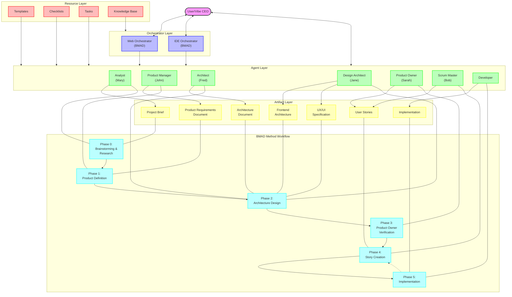

```mermaid
flowchart TB
    %% Main Components
    User(["User/Vibe CEO"])
    
    %% Orchestrator Layer
    subgraph Orchestrators["Orchestrator Layer"]
        WebOrch["Web Orchestrator\n(BMAD)"]
        IDEOrch["IDE Orchestrator\n(BMAD)"]
    end
    
    %% Agent Layer
    subgraph Agents["Agent Layer"]
        Analyst["Analyst\n(Mary)"]
        PM["Product Manager\n(John)"]
        Architect["Architect\n(Fred)"]
        DesignArch["Design Architect\n(Jane)"]
        PO["Product Owner\n(Sarah)"]
        SM["Scrum Master\n(Bob)"]
        Dev["Developer"]
    end
    
    %% Resource Layer
    subgraph Resources["Resource Layer"]
        Templates["Templates"]
        Checklists["Checklists"]
        Tasks["Tasks"]
        KnowledgeBase["Knowledge Base"]
    end
    
    %% Artifact Layer
    subgraph Artifacts["Artifact Layer"]
        ProjectBrief["Project Brief"]
        PRD["Product Requirements\nDocument"]
        ArchDoc["Architecture\nDocument"]
        FrontendArch["Frontend\nArchitecture"]
        UXUISpec["UX/UI\nSpecification"]
        Stories["User Stories"]
        Implementation["Implementation"]
    end
    
    %% Workflow Phases
    subgraph Workflow["BMAD Method Workflow"]
        Phase0["Phase 0:\nBrainstorming &\nResearch"]
        Phase1["Phase 1:\nProduct Definition"]
        Phase2["Phase 2:\nArchitecture Design"]
        Phase3["Phase 3:\nProduct Owner\nVerification"]
        Phase4["Phase 4:\nStory Creation"]
        Phase5["Phase 5:\nImplementation"]
    end
    
    %% User Interactions
    User <--> WebOrch
    User <--> IDEOrch
    User <--> Agents
    
    %% Orchestrator Connections
    WebOrch --> Agents
    IDEOrch --> Agents
    
    %% Resource Connections
    Templates --> Agents
    Checklists --> Agents
    Tasks --> Agents
    KnowledgeBase --> Orchestrators
    
    %% Agent to Artifact Connections
    Analyst --> ProjectBrief
    PM --> PRD
    Architect --> ArchDoc
    DesignArch --> FrontendArch
    DesignArch --> UXUISpec
    PO --> Stories
    SM --> Stories
    Dev --> Implementation
    
    %% Workflow Connections
    Phase0 --> Phase1
    Phase1 --> Phase2
    Phase2 --> Phase3
    Phase3 --> Phase4
    Phase4 --> Phase5
    Phase5 -.-> Phase4
    
    %% Agent to Workflow Connections
    Analyst --- Phase0
    PM --- Phase1
    Architect --- Phase2
    DesignArch --- Phase2
    PO --- Phase3
    SM --- Phase4
    Dev --- Phase5
    
    %% Artifact to Workflow Connections
    ProjectBrief --- Phase0
    PRD --- Phase1
    ArchDoc --- Phase2
    FrontendArch --- Phase2
    UXUISpec --- Phase2
    Stories --- Phase4
    Implementation --- Phase5
    
    %% Styling
    classDef user fill:#f9f,stroke:#333,stroke-width:2px
    classDef orchestrator fill:#bbf,stroke:#33f,stroke-width:2px
    classDef agent fill:#bfb,stroke:#3f3,stroke-width:2px
    classDef resource fill:#fbb,stroke:#f33,stroke-width:2px
    classDef artifact fill:#ffb,stroke:#ff3,stroke-width:2px
    classDef workflow fill:#bff,stroke:#3ff,stroke-width:2px
    
    class User user
    class WebOrch,IDEOrch orchestrator
    class Analyst,PM,Architect,DesignArch,PO,SM,Dev agent
    class Templates,Checklists,Tasks,KnowledgeBase resource
    class ProjectBrief,PRD,ArchDoc,FrontendArch,UXUISpec,Stories,Implementation artifact
    class Phase0,Phase1,Phase2,Phase3,Phase4,Phase5 workflow
```
